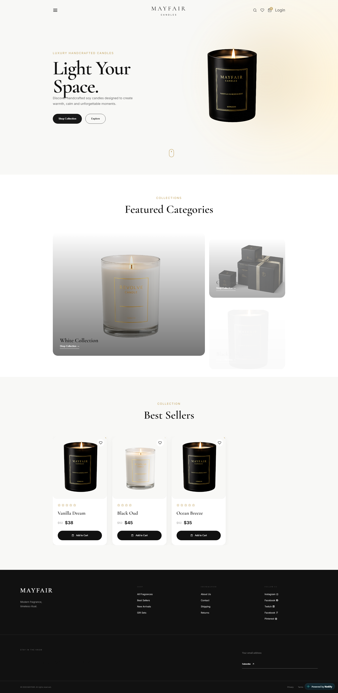

# 🕯️ Mayfair Candles

> A modern luxury candle e-commerce website built with React.js and Vite, featuring an elegant, minimal interface designed to create a premium online shopping experience.


---

<table>
  <tr>
    <td>
      
## ✨ Overview

**Mayfair Candles** is a modern e-commerce frontend project for a luxury handcrafted candle brand.

The website focuses on a clean and sophisticated visual experience with carefully designed product cards, collections, navigation, calls-to-action, and responsive layouts.

The project was built to practice and demonstrate modern frontend development using **React.js, Vite, JavaScript, and responsive UI techniques**.

---

## 🛠️ Technologies Used

### Frontend

- ⚛️ React.js
- ⚡ Vite
- 🟨 JavaScript (ES6+)
- 🎨 CSS3
- 📱 Responsive Web Design
- 🧩 React Components

### Development Tools

- Git
- GitHub
- VS Code
- npm

  ---
  
## 🌐 Live Demo

🔗 **Live Website:**  
[View Live Demo](https://mayfairr.netlify.app/)

🔗 **GitHub Repository:**  
[View Source Code](YOUR_GITHUB_REPOSITORY_LINK)

      
  </td>
    <td>
      <p align="center">
  
</p>
    </td>
  </tr>
</table>

---

## 🚀 Main Features

- 🕯️ Luxury candle e-commerce interface
- 🏠 Modern hero section
- 🛍️ Featured product collections
- ⭐ Best-selling products section
- ❤️ Wishlist interaction
- 🛒 Add-to-cart interface
- 🔍 Search interface
- 📱 Responsive layout
- 🎨 Premium minimalist UI
- 🧩 Reusable React components
- 🔗 Product and navigation sections
- 📧 Newsletter subscription section
- 🦶 Responsive footer with useful links

---

## 📸 Website Sections

### 🏠 Hero Section

A premium hero section introducing the Mayfair Candles brand with a strong headline, product visual, and clear call-to-action buttons.

### 🕯️ Featured Categories

Displays the main candle collections in a visually engaging card-based layout.

### ⭐ Best Sellers

Showcases popular products with:

- Product image
- Product name
- Rating
- Current price
- Previous price
- Wishlist button
- Add to Cart button

### 📰 Footer

Includes:

- Brand information
- Shop navigation
- Company information
- Social media links
- Newsletter subscription
- Privacy and Terms links

---

## 📦 Dependencies

The project uses the following main dependencies:

```bash
react
react-dom

```
---

## 💻 Run This Project Locally

Follow these steps to run the project on your local machine.

1. Clone the repository
git clone YOUR_GITHUB_REPOSITORY_LINK
2. Navigate into the project
cd mayfair-candles
3. Install dependencies
npm install
4. Start the development server
npm run dev
5. Open the project

Vite will provide a local development URL similar to:

http://localhost:5173

Open it in your browser.

## 📁 Project Structure

```text
mayfair-candles/
│
├── public/
│   └── assets/
│
├── src/
│   ├── assets/
│   │
│   ├── components/
│   │   ├── Navbar/
│   │   ├── Hero/
│   │   ├── Categories/
│   │   ├── ProductCard/
│   │   ├── BestSellers/
│   │   └── Footer/
│   │
│   ├── pages/
│   │
│   ├── App.jsx
│   ├── main.jsx
│   └── index.css
│
├── screenshot.png
├── index.html
├── package.json
├── vite.config.js
└── README.md

```

The exact structure may vary depending on the final project implementation.

## 🎯 Learning Goals

This project was created to improve practical frontend development skills, including:

- Building reusable React components
- Managing component-based UI
- Creating responsive layouts
- Working with product data
-  Creating reusable product cards
- Implementing interactive UI elements
- Improving CSS layout and styling
- Building a real-world e-commerce interface
- Structuring a React project professionally
- 📱 Responsive Design

The website is designed to provide a consistent experience across:

- 💻 Desktop
- 💻 Laptop
- 📱 Tablet
- 📱 Mobile
- 🔮 Future Improvements

Some features that can be added in future versions:

```text
 Product details page
 Shopping cart functionality
 Wishlist page
 Product search
 Product filtering
 Product sorting
 Checkout page
 Authentication
 Backend API integration
 Database integration
 Payment integration
 Admin dashboard

```

## 👨‍💻 Author

**MD. Kamrul Islam**

Frontend Developer passionate about creating modern, responsive, and user-friendly web experiences.

Connect With Me
GitHub: @kamrulcode

## 📄 License

This project is created for learning and portfolio purposes.

---

⭐ **If you like this project, consider giving it a star** !
