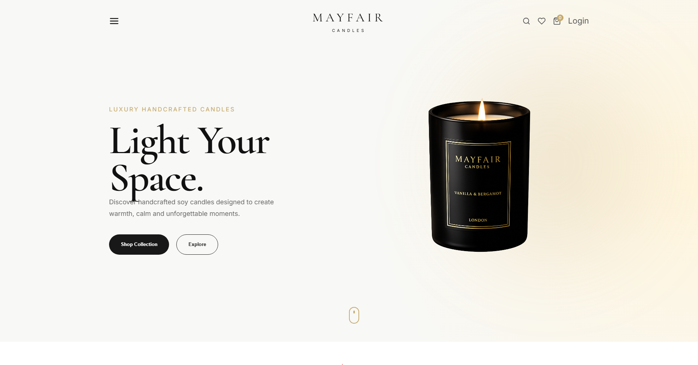

# 🕯️ Mayfair Candles

> A modern luxury candle e-commerce website built with React.js and Vite, featuring an elegant, minimal interface designed to create a premium online shopping experience.

<p align="center">
  
</p>

---

## ✨ Overview

**Mayfair Candles** is a modern e-commerce frontend project for a luxury handcrafted candle brand.

The website focuses on a clean and sophisticated visual experience with carefully designed product cards, collections, navigation, calls-to-action, and responsive layouts.

The project was built to practice and demonstrate modern frontend development using **React.js, Vite, JavaScript, and responsive UI techniques**.

---

## 🌐 Live Demo

🔗 **Live Website:**  
[View Live Demo](https://mayfairr.netlify.app/)

🔗 **GitHub Repository:**  
[View Source Code](YOUR_GITHUB_REPOSITORY_LINK)

---

## 🛠️ Technologies Used

### Frontend

- ⚛️ React.js
- ⚡ Vite
- 🟨 JavaScript (ES6+)
- 🎨 CSS3
- 📱 Responsive Web Design
- 🧩 React Components

### Development Tools

- Git
- GitHub
- VS Code
- npm

---

## 🚀 Main Features

- 🕯️ Luxury candle e-commerce interface
- 🏠 Modern hero section
- 🛍️ Featured product collections
- ⭐ Best-selling products section
- ❤️ Wishlist interaction
- 🛒 Add-to-cart interface
- 🔍 Search interface
- 📱 Responsive layout
- 🎨 Premium minimalist UI
- 🧩 Reusable React components
- 🔗 Product and navigation sections
- 📧 Newsletter subscription section
- 🦶 Responsive footer with useful links

---

## 📸 Website Sections

### 🏠 Hero Section

A premium hero section introducing the Mayfair Candles brand with a strong headline, product visual, and clear call-to-action buttons.

### 🕯️ Featured Categories

Displays the main candle collections in a visually engaging card-based layout.

### ⭐ Best Sellers

Showcases popular products with:

- Product image
- Product name
- Rating
- Current price
- Previous price
- Wishlist button
- Add to Cart button

### 📰 Footer

Includes:

- Brand information
- Shop navigation
- Company information
- Social media links
- Newsletter subscription
- Privacy and Terms links

---

## 📦 Dependencies

The project uses the following main dependencies:

```bash
react
react-dom
